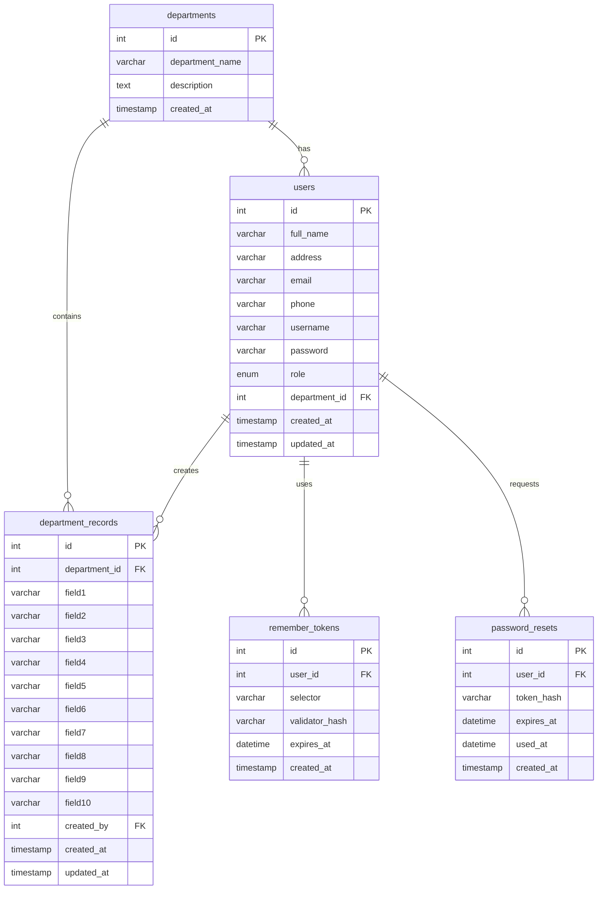

# Database ER Diagram

```mermaid
erDiagram
    departments ||--o{ users : has
    departments ||--o{ department_records : contains
    users ||--o{ department_records : creates
    users ||--o{ remember_tokens : uses
    users ||--o{ password_resets : requests

    departments {
        int id PK
        varchar department_name
        text description
        timestamp created_at
    }

    users {
        int id PK
        varchar full_name
        varchar address
        varchar email
        varchar phone
        varchar username
        varchar password
        enum role
        int department_id FK
        timestamp created_at
        timestamp updated_at
    }

    department_records {
        int id PK
        int department_id FK
        varchar field1
        varchar field2
        varchar field3
        varchar field4
        varchar field5
        varchar field6
        varchar field7
        varchar field8
        varchar field9
        varchar field10
        int created_by FK
        timestamp created_at
        timestamp updated_at
    }

    remember_tokens {
        int id PK
        int user_id FK
        varchar selector
        varchar validator_hash
        datetime expires_at
        timestamp created_at
    }

    password_resets {
        int id PK
        int user_id FK
        varchar token_hash
        datetime expires_at
        datetime used_at
        timestamp created_at
    }
```
